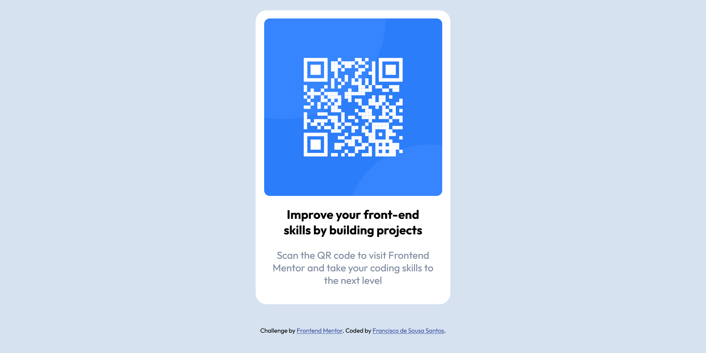

# Frontend Mentor - QR code component solution

This is a solution to the [QR code component challenge on Frontend Mentor](https://www.frontendmentor.io/challenges/qr-code-component-iux_sIO_H). Frontend Mentor challenges help you improve your coding skills by building realistic projects.

## Overview

It was a simple challenge without too many elements in it.
Had most difficulty in being able to resize the image and fit it accordingly to what was asked. Luckily the solution was simple and didn't take too long to resolve.

### Screenshot

### Links

-   Live Site URL: [Vercel](https://your-live-site-url.com)

### Built with

-   Semantic HTML5 markup
-   CSS custom properties
-   Flexbox
-   SASS
